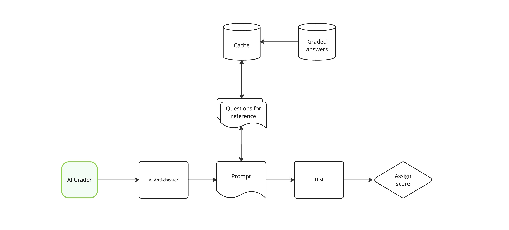

# ADR 001: Using a relational database with caching instead of a vector database

## Context

Certifiable's certification process is scaling fast, and we need a solid way to provide reference answers for the AI Grader. A common approach would be using a **vector database** with embeddings to find similar past answers, but **we already know the questions**. There's no need for semantic search when we can directly retrieve structured, pre-graded answers.

Instead of relying on embeddings, we're using a **relational database with a caching layer**. This ensures **structured, deterministic retrieval** of correct and incorrect answers, improving speed, control, and consistency while avoiding unnecessary complexity.

## Decision

We **decided not to use a vector database** and opted for a relational database with caching for reference answer retrieval. Why? 

- **We know the question** → No need for embedding-based similarity search.
- **Lower overhead** → No need to store, update, or compute embeddings.
- **Predictability** → Instead of a "black box" similarity score, we explicitly control how many correct and incorrect answers get retrieved.
- **Speed** → Cached queries are significantly faster than embedding lookups.

### Implementation:

- Store a **curated set of correct and incorrect answers** for each question.
- Use **query logic** to retrieve a balanced selection of N correct and N incorrect answers for AI prompt augmentation.
- Implement a **caching layer** (e.g., Redis) to speed up retrieval of frequently accessed reference answers.

## Alternatives considered

Initially, we considered using a vector database to retrieve reference answers based on semantic similarity. The reasoning was that embeddings could allow the AI Grader to find conceptually similar responses, even when phrasing differed.

After taking a closer look at this approach, we realized it came with some challenges:

- **We don’t need semantic search** → Since the questions are known, a structured query retrieving pre-graded answers is sufficient.
- **Operational overhead** → Maintaining an embedding pipeline adds complexity, requiring periodic updates and additional compute resources.
- **Lack of control** → A similarity-based retrieval method could introduce inconsistencies, whereas a direct query approach ensures a balanced selection of reference answers.

Given these factors, we concluded that a relational database with caching was the **more efficient and reliable** choice.

## Consequences

This approach makes the AI Grader **faster, cheaper, and more reliable** by removing unnecessary complexity.

- **Faster access** → The cache serves reference answers instantly instead of running embedding searches.
- **Simpler infra** → No extra vector database to maintain, just a well-optimized relational DB.
- **Better grading consistency** → Explicit selection of reference answers ensures fairness.
- **Lower cost** → No need to generate, store, or query embeddings.

## Returns

By avoiding a vector database, we cut infrastructure costs and reduce complexity while keeping grading quality high.

- **Latency improvement** → Cached queries mean near-instant reference retrieval.
- **Infrastructure savings** → No additional costs for embedding storage and compute.
- **Operational simplicity** → Less maintenance, fewer moving parts.

## Tradeoffs

There are some tradeoffs, but they’re manageable.

- **Less flexibility** → Unlike vector search, this method won’t adapt to nuanced variations in meaning. It relies on **explicitly curated answers**.
- **Cache invalidation** → We need to manage expiration policies to avoid serving outdated references.
- **Reference diversity** → Ensuring a good mix of correct and incorrect answers requires ongoing updates to the dataset.

## Conclusion

By **ditching the vector DB** and using a relational database with caching, we **simplify infra, reduce costs, and keep grading predictable**. The AI Grader gets exactly what it needs, without unnecessary complexity.
